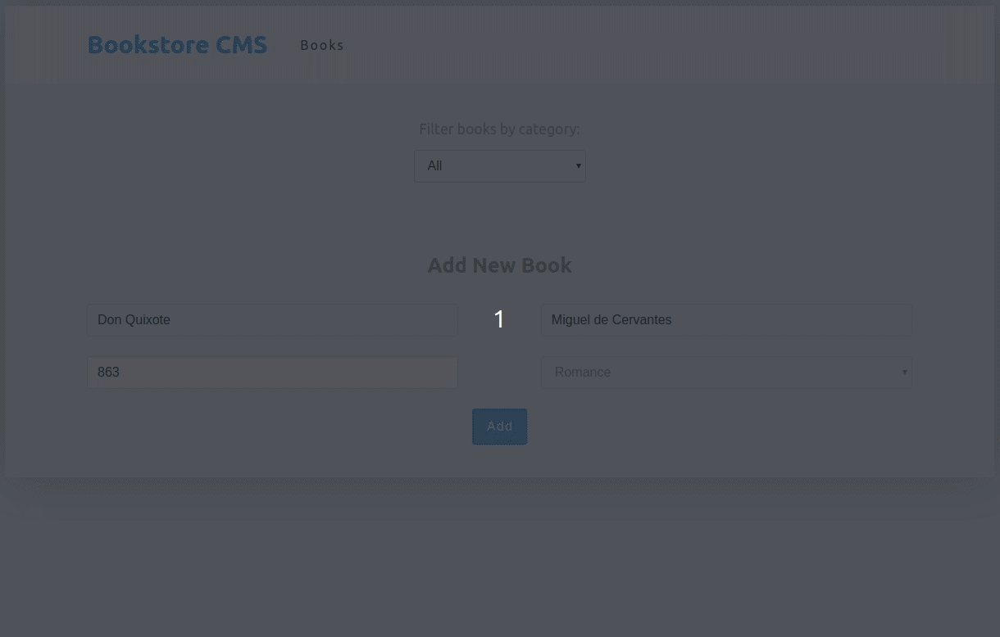

# Bookstore App (React and Redux)

This project is one of the Main React and Redux curriculum projects at [Microverse](https://https://www.microverse.org/) - @microverseinc

The objective is to create a simple bookstore app using React and Redux. This application is integrated with an external API. The API was created with Rails and it's hosted on heroku. All changes made in this app are saved in the external API. The app features include:

- Create book.
- Edit book.
- Update book progress.
- Delete book.
- Filter book by category.

## Preview



## Built With

- React.
- React-Router.
- Redux.
- Axios.
- Node-sass.

## Tests

At the current moment, tests were not implemented yet. I will implement unit and integration tests soon.

## Live Demo

[Live Link](https://ssf-bookstore.netlify.com/)

## Future Updates and Improvements

- I will refactor the application.
- Apply Unit and Integration tests.
- Connect with a new API.
- Improve the UI.

## Getting Started

Get a local copy by cloning the repo and following these simple steps.

### Prerequisites

- npm and yarn

### Install

```bash
yarn install
```

### Usage

```bash
yarn start
```

### Deployment

```bash
yarn build
```

## Authors

👤 **Sérgio Torres**

- Github: [Torres-ssf](https://github.com/Torres-ssf)
- Twitter: [@torres_ssf](https://twitter.com/torres_ssf)
- Linkedin: [torres-ssf](https://www.linkedin.com/in/torres-ssf/)


## 🤝 Contributing

Contributions, issues and feature requests are welcome!

Feel free to check the [issues page](https://github.com/Torres-ssf/react-bookstore/issues).

## Show your support

Give a ⭐️ if you like this project!

## 📝 License

This project is [MIT](./LICENSE) licensed.
